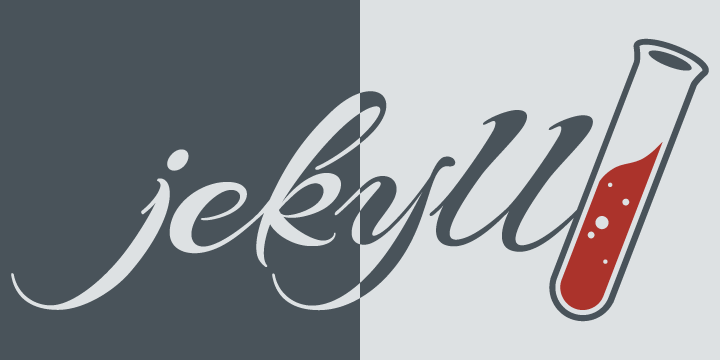

# This is a **markdown**(H1)
***
## Hi I'm kjm081. (H2)
### This is first posting. (H3)
#### Good to see you. (H4)

body{ /\* 정렬 및 배치 \*/ display: flex; justify-content: center; /\* 배경 색상을 변경할 수 있어요! \*/ /\* background-color: #c3c9c954; \*/ background-color: rgb(240, 10, 221); } div.contents{ /\* 정렬 및 배치 \*/ display: flex; flex-direction: column; justify-content: center; align-content: center; width: 840px; } h1.title{ /\* 정렬 및 배치 \*/ display: flex; flex-direction: row; justify-content: start; padding: 15px; margin-bottom: 10px; /\* 웹페이지 제목 칸 색상을 바꿀 수 있어요! \*/ background-color: rgb(15, 87, 241); font-size: larger; /\* 테두리를 설정할 수 있어요 \*/ /\* border-radius: 10px; border: 2px solid #6ad8d3; \*/ } ul{ list-style: none; } li{ float: left; } a{ padding-right: 30px; text-decoration: none; color: rgb(236, 10, 10); font-weight: 600; } /\* nav바 \*/ div.nav{ display: flex; flex-direction: row; align-items: center; height: 35px; margin-bottom: 10px; background-color: #07e249; text-decoration-line: none; /\* 테두리를 설정할 수 있어요 \*/ /\* border-radius: 10px; border: 3px solid #6ad8d3; \*/ } div.main\_aboutMe{ display: flex; flex-direction: column; align-items: center; min-height: 70vh; padding: 50px; background-color: rgb(10, 223, 238); /\* 테두리를 설정할 수 있어요 \*/ /\* border-radius: 10px; \*/ border: 3px solid #6ad8d3; } /\* 제목 \*/ p.title{ display: flex; flex-direction: row; justify-content: center; padding: 15px; margin-bottom: 4px; font-size: larger; } /\* 이미지 칸 \*/ img#profile{ width: 150px; border-radius: 100px; border: 2px solid #6ad8d3; margin-bottom: 10px; } 나만의 웹페이지 

웹
=

*   [About me](AboutMe.html)
*   [About like](AboutLike.html)
*   [Quiz](quiz.html)

나에대한 이야기